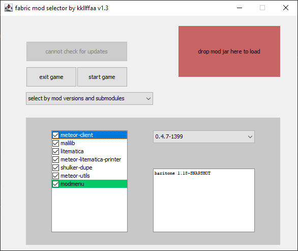

fabric-mod-selector
===========

Modified Fabric Loader that allow to select mods to load when game is starting

## Install

- open %appdata%/.minecraft/versions/version_name/version_name.json
- search for "net.fabricmc:fabric-loader"
- change name to kkllffaa.fabric-mod-selector.releases:download:1.0
- change url to https://github.com/
